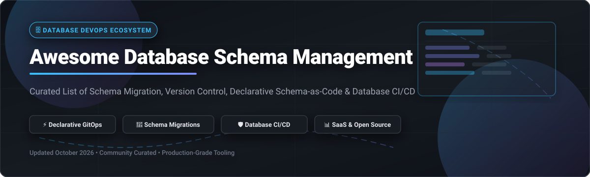

# 🗄️ Awesome Database Schema Management

  
  
  
  

## 📌 Overview & Ecosystem Architecture

Welcome to the ultimate curated list of **Database Schema Management**, **Schema Migration**, **Declarative Schema-as-Code**, and **Database DevOps / CI/CD** platforms. 

Managing database schemas in modern software engineering requires automated migration execution, declarative diffing, automated SQL safety linting, and GitOps review workflows. This repository tracks both production-grade commercial SaaS platforms and leading open-source GitHub projects.

---

## 📑 Table of Contents

- [📊 Market Overview & Sector Dynamics](#-market-overview--sector-dynamics)
- [🏢 SaaS & Hosted Commercial Platforms](#-saas--hosted-commercial-platforms)
- [⚡ Open-Source GitHub Projects](#-open-source-github-projects)
- [🛠️ Deep Dive by Category](#️-deep-dive-by-category)
  - [Imperative Migration Engines](#imperative-migration-engines)
  - [Declarative Schema-as-Code](#declarative-schema-as-code)
  - [Database DevOps & Governance Platforms](#database-devops--governance-platforms)
  - [ORM & Language Native Migrations](#orm--language-native-migrations)
- [🤝 How to Contribute](#-how-to-contribute)
- [📈 Star History](#-star-history)
- [💖 Support](#-support)
- [⚖️ Disclaimer](#️-disclaimer)

---

## 📊 Market Overview & Sector Dynamics

> 💡 **Estimated Market Size & Sector Fragmentation**:  
> The global **Database Schema Management and Database DevOps** market is estimated at **$1.8 Billion – $2.4 Billion (2026)**, expanding at a **~18.5% CAGR** driven by cloud-native database adoption, continuous deployment practices, and enterprise governance requirements.  
> 
> The sector is **moderately fragmented**:  
> - **Legacy Incumbents** (Redgate, Liquibase) dominate enterprise SQL Server and multi-database change management with deep compliance toolchains.  
> - **Modern Cloud-Native Challengers** (Atlas, Bytebase, Prisma) lead developer-first GitOps, declarative schema-as-code, and automated pull-request review workflows.

---

## 🏢 SaaS & Hosted Commercial Platforms

Below is the comparative breakdown of commercial SaaS and Enterprise schema management platforms, sorted by **Company Valuation / Size (descending)**:

| 🏢 Platform | 💰 Starting Price | 🎁 Free Tier / Trial Limit | 📊 Company Size / Valuation | 🎯 Key Focus & Capabilities |
| :--- | :--- | :--- | :--- | :--- |
| **[Redgate Flyway Enterprise](https://www.red-gate.com/products/flyway/enterprise/)** | `$1,410 / user / year` *(SQL Toolbelt)* | 14-day free trial (Full enterprise feature access) | **~$1.0B Valuation** *(~$100M+ ARR)* | Enterprise DevOps, auto-undo script generation, drift detection, object-level versioning for Oracle, SQL Server, Postgres & MySQL. |
| **[Liquibase Enterprise](https://www.liquibase.com/)** | `$500 / user / year` *(Starter plan)* | 30-day free trial (Up to 5 database targets) | **~$250M Valuation** *(~$50M ARR)* | Enterprise compliance (SOX, PCI-DSS, DORA), automated policy check enforcement, structured rollbacks & changelog governance. |
| **[SqlDBM](https://sqldbm.com/)** | `$25 / user / month` *(Personal plan)* | Free Tier: 1 active project & 1 database connection forever | **~$50M Valuation** *(~$12M ARR)* | Cloud-native visual schema design, ER modeling, forward/reverse engineering for Snowflake, Databricks, BigQuery & Postgres. |
| **[Bytebase Cloud](https://bytebase.com/)** | `$20 / user / month` *(Pro plan)* | Free Tier: up to 20 users & 10 database instances forever | **~$25M Valuation** *(~$4M ARR)* | Web-based database CI/CD, 200+ SQL lint rules, DBA review workflows, access control & data masking for 50+ database engines. |
| **[DBmaestro](https://www.dbmaestro.com/)** | `$1,200 / database / year` | 14-day free trial (Up to 2 database engines & 5 users) | **~$20M Valuation** *(~$5M ARR)* | State-based release automation, pre/post update state verification, collision detection & automated drift adaptation. |
| **[VersionSQL](https://www.versionsql.com/)** | `$79 / user / year` *(Single license)* | 30-day free trial (Unlimited database objects) | **~$5M Valuation** *(~$1M ARR)* | Lightweight Git & SVN schema version control integrated into SQL Server Management Studio (SSMS) & Visual Studio. |

---

## ⚡ Open-Source GitHub Projects

The open-source database schema management ecosystem is robust and production-proven. The projects below are sorted by **GitHub Stars_Count (descending)**:

| 📦 Open-Source Project | ⭐ GitHub_Stars | 📜 License | 🗄️ Primary Model | 🚀 Best For |
| :--- | :---: | :--- | :--- | :--- |
| **[Prisma Migrate](https://github.com/prisma/prisma)** |  | Apache-2.0 | Hybrid Declarative | Node.js & TypeScript full-stack applications with declarative schema files. |
| **[Drizzle Kit](https://github.com/drizzle-team/drizzle-orm)** |  | Apache-2.0 | Declarative SQL | Modern TypeScript backends requiring fast SQL generation and schema prototyping. |
| **[golang-migrate](https://github.com/golang-migrate/migrate)** |  | MIT | Imperative SQL | Go microservices and CLI tools migrating Postgres, MySQL, SQLite, Redshift & Spanner. |
| **[Bytebase Community](https://github.com/bytebase/bytebase)** |  | Apache-2.0 | GitOps DevOps | Multi-tenant developer teams needing CNCF web-based DB review & audit logging. |
| **[Flyway Community](https://github.com/flyway/flyway)** |  | Apache-2.0 | Imperative SQL | Java / Spring Boot applications wanting simple, SQL-first versioned migration files. |
| **[Atlas](https://github.com/ariga/atlas)** |  | Apache-2.0 | Declarative HCL/SQL | Terraform-like declarative schema diffing with 50+ safety linter rules and Security-as-Code. |
| **[Liquibase Community](https://github.com/liquibase/liquibase)** |  | FSL-1.1 | Changelog Abstract | Enterprise polyglot applications requiring database-agnostic XML/YAML/SQL rollbacks. |
| **[DbUp](https://github.com/DbUp/DbUp)** |  | Apache-2.0 | Imperative SQL | .NET applications deploying versioned plain SQL scripts during application startup. |
| **[Skeema](https://github.com/skeema/skeema)** |  | Apache-2.0 | Pure SQL Declarative | MySQL and MariaDB databases using declarative `CREATE TABLE` files in Git with PR workflows. |
| **[Alembic](https://github.com/sqlalchemy/alembic)** |  | MIT | Python Migration | Python applications using SQLAlchemy ORM for auto-generating migration scripts. |
| **[Sqitch](https://github.com/sqitchers/sqitch)** |  | MIT | Dependency Graph | Large monolith databases requiring non-sequential dependency resolution and verify scripts. |
| **[SchemaHero](https://github.com/schemahero/schemahero)** |  | Apache-2.0 | Kubernetes CRD | Kubernetes-native GitOps schema management using custom resource definitions (CRDs). |
| **[grate](https://github.com/erikbra/grate)** |  | Apache-2.0 | Plain SQL Script | Teams executing plain .sql scripts across SQL Server, Postgres, MySQL & SQLite via Docker/CLI. |

---

## 🛠️ Deep Dive by Category

### Imperative Migration Engines
- 🟢 **Flyway**: Standard SQL-first migration runner. Applied migrations are tracked via `flyway_schema_history` table. Supports 50+ DB engines.
- 🟡 **Liquibase**: Uses abstraction layers (`changelog` with `changesets`) defined in SQL, XML, YAML, or JSON. Built-in rollback handling across 60+ databases.
- 🔵 **golang-migrate**: Minimalist Go library and CLI tool. Executes paired `.up.sql` and `.down.sql` scripts.

### Declarative Schema-as-Code
- 🚀 **Atlas**: Inspires Terraform workflows for database schemas. Inspects target DB state, computes schema diffs, and plans safe migration steps.
- 🐬 **Skeema**: Keeps pure SQL `CREATE TABLE` definitions in Git. Computes live `ALTER TABLE` statements against MySQL/MariaDB targets.
- ☸️ **SchemaHero**: Declarative operator for Kubernetes clusters. Applies table schema changes directly from YAML manifests.

### Database DevOps & Governance Platforms
- 🛡️ **Bytebase**: Web-based database CI/CD portal included in the CNCF Landscape. Offers 200+ SQL lint rules, approval pipelines, data masking, and drift prevention.
- 🏛️ **Redgate SQL Toolbelt**: Standard release automation suite for SQL Server, Oracle, and enterprise database infrastructure.

---

## 🤝 How to Contribute

Contributions are welcome! Please follow these steps:
1. Fork the repository.
2. Create a new branch (`git checkout -b add-new-tool`).
3. Add your tool to the appropriate section following the tabular format.
4. Ensure factual information for pricing, free tier, and GitHub star links.
5. Open a Pull Request.

Please check out our list of awesome repositories at [Awesome-Awesome-Awesome](https://github.com/ishandutta2007/Awesome-Awesome-Awesome).

---

## 📈 Star History

---

## 💖 Support

Thank you for visiting and supporting **Awesome Database Schema Management**! If this list has helped you evaluate tools, automate database deployments, or learn about schema GitOps:

- ⭐ **Star this repository** to show your support!
- 🔀 **Fork it** to customize or contribute additions!
- 📢 **Share it** with fellow developers, DBAs, and DevOps engineers!

If you'd like to buy me a coffee or sponsor open-source curation work:  
👉 **[Sponsor on GitHub Sponsors](https://github.com/sponsors/ishandutta2007)** 💖

---

## ⚖️ Disclaimer

This repository is a community-curated list for educational and tool evaluation purposes. Product names, logos, and trademarks belong to their respective owners. License conditions (such as Liquibase FSL-1.1 or Redgate licensing) should be reviewed prior to commercial deployment.

---

**Made with ❤️ for DBAs, DevOps Engineers, Platform Engineers, and Developers worldwide.**
